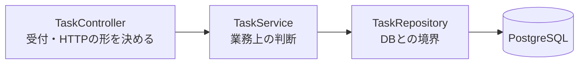

# API設計書 — TaskManagement

← [要件定義書](./requirements.md) に戻る

関連文書：[機能要件・ユースケース](./functional-requirements.md) ／ [画面設計書](./screen-design.md) ／ [データ設計書](./data-design.md) ／ [技術スタック](./tech-stack.md)

| 項目 | 内容 |
|---|---|
| 最終更新日 | 2026-09-12 |
| 版 | 1.3 |

---

## 1. 共通事項

| 項目 | 内容 |
|---|---|
| ベースURL | `http://localhost:8080` |
| 形式 | JSON（`Content-Type: application/json`） |
| 文字コード | UTF-8 |
| 認証 | **なし**（[要件定義書](./requirements.md)のとおり、利用者1名・ローカル専用のため） |

現時点で実装されているのは**読み取り（GET）と登録（POST）と更新（PUT / PATCH）**。削除は未実装（6章）。

## 2. エンドポイント一覧

| # | メソッド | パス | 内容 | 実装 |
|---|---|---|---|---|
| 1 | GET | `/api/tasks` | 全件取得 | 済 |
| 2 | GET | `/api/tasks/{id}` | 1件取得 | 済 |
| 3 | GET | `/api/tasks/status/{status}` | status で絞り込み | 済 |
| 4 | POST | `/api/tasks` | 1件登録 | 済 |
| 5 | PUT | `/api/tasks/{id}` | 1件の内容を更新 | 済 |
| 6 | PATCH | `/api/tasks/{id}/status` | 状態だけ更新（列間移動） | 済 |
| 7 | DELETE | `/api/tasks/{id}` | 1件削除 | 済 |

### 2.1 GET /api/tasks

全件を返す。並びは `status` 昇順 → `sort_order` 昇順。

**`status` は文字列なので、並びはアルファベット順（`doing` → `done` → `todo`）になり、ボードの表示順（未着手 → 作業中 → 完了）とは一致しない。** 画面側が `status` ごとに振り分けて表示するため、実害はない。表示順を API 側で保証したくなった時点で、`status` を数値の並び順に対応させるか、専用の並び替えを入れる。

| 状態 | コード | 本文 |
|---|---|---|
| 正常 | 200 | Task の配列。0件なら `[]` |

### 2.2 GET /api/tasks/{id}

| 状態 | コード | 本文 |
|---|---|---|
| 見つかった | 200 | Task 1件 |
| 見つからない | **404** | なし |

**存在しない ID を空の JSON で返さない。** 空で返すと、呼び出し側が「無かった」と「中身が空だった」を区別できなくなるため。

### 2.3 GET /api/tasks/status/{status}

`{status}` は `todo` / `doing` / `done`（[データ設計書](./data-design.md) 4章）。並びは `sort_order` 昇順。

| 状態 | コード | 本文 |
|---|---|---|
| 正常 | 200 | Task の配列。該当が0件でも `[]`（404 にはしない。0件は正常な結果） |

**このエンドポイントは現時点でどの画面からも呼ばれない。** F-01 のボード表示は全件を1回取得して画面側で振り分けるため、通信は1回で足りる。講義に合わせて用意しているが、使われないまま残る可能性がある。

### 2.4 POST /api/tasks

1件登録する（[F-02](./functional-requirements.md#f-02-カードの新規作成)）。

**受け取る項目**

| 項目 | 必須 | 型 | 制約 |
|---|---|---|---|
| `title` | **必須** | 文字列 | 空白だけは不可。100文字まで |
| `description` | 任意 | 文字列 | 制限なし |
| `dueDate` | 任意 | 文字列 | `"2026-09-12"` の形。時刻は持たない |
| `priority` | 任意 | 文字列 | `high` / `medium` / `low` |
| `status` | 任意 | 文字列 | `todo` / `doing` / `done`。**省略すると `todo`** |

```json
{ "title": "買い出しに行く", "dueDate": "2026-09-15", "priority": "high", "status": "todo" }
```

**送れない項目がある。** `id` / `createdAt` / `updatedAt` / `sortOrder` は受け口そのものを用意していない（`TaskCreateRequest`）。Task をそのまま受け取る形にすると、送られたものを無視するコードを書いて防ぐことになる。

| 値 | 決めるのは |
|---|---|
| `id` | データベース（自動採番） |
| `createdAt` / `updatedAt` | Hibernate（`@CreationTimestamp` / `@UpdateTimestamp`） |
| `sortOrder` | `TaskService`。**同じ `status` の最大値 + 1**。F-02「作成されたカードはその列の末尾に追加される」に対応する。その列が空なら 1 |

**返すもの**

| 状態 | コード | 本文 |
|---|---|---|
| 登録できた | **201 Created** | 作成された Task 1件（`id` と `sortOrder` が入る） |
| 入力が不正 | **400** | 下記。**データベースには何も入らない** |

200 ではなく 201 を返すのは、「要求を処理した」だけでなく「新しいものが増えた」ことを状態コードで区別するため。`Location` ヘッダーは付けない（呼ぶのは自分の画面1つで、本体に `id` が入っているため、URL を別途伝える相手がいない）。

**400 の本文には理由が入らない（実測）**

```json
{"timestamp":"2026-09-09T21:48:07.650Z","status":400,"error":"Bad Request","path":"/api/tasks"}
```

タイトルが空・`status` が不正・日付の形式違い、**どれも同じ本文が返る**。Spring Boot 4.1.1 の既定であり、次の2つを試しても項目ごとの理由は出なかった。

| 試した設定 | 結果 |
|---|---|
| `server.error.include-message=always` | 本文は変わらなかった |
| `spring.mvc.problemdetails.enabled=true`（既定は `false`） | 形は RFC 9457 になるが `detail` は `"Invalid request content."` 止まり。**「入力が不正」と「そもそも読めなかった」の区別はつく** |

得られるものが小さいのでどちらも入れていない。**したがって、画面に出す文言はフロント側が自前で持つ。** サーバー側の制約に `message = "タイトルは必須です"` のような文言を書いても届かないので、書いていない。

> 実測の方法：`@SpringBootTest(webEnvironment = RANDOM_PORT)` で実際に HTTP を往復させた。**`MockMvc` では本文が空になる**（エラー用の `/error` への転送を再現しないため）ので、この確認には使えない。

### 2.5 PUT /api/tasks/{id}

1件の内容を丸ごと書き換える（[F-03](./functional-requirements.md#f-03-カードの編集)）。

**受け取る項目**

| 項目 | 必須 | 型 | 制約 |
|---|---|---|---|
| `title` | **必須** | 文字列 | 空白だけは不可。100文字まで |
| `description` | 任意 | 文字列 | 制限なし |
| `dueDate` | 任意 | 文字列 | `"2026-09-12"` の形 |
| `priority` | 任意 | 文字列 | `high` / `medium` / `low` |
| `status` | **必須** | 文字列 | `todo` / `doing` / `done` |

**`status` は登録（2.4）と違って必須。** 省略を許すと「省略されたら `todo`」という *登録時* の判断が更新にも及び、作業中のカードを保存しただけで未着手に戻る。画面は編集モーダルに現在の状態を出しているので、常に送れる。

送れない項目は登録と同じ（`id` / `createdAt` / `updatedAt` / `sortOrder`）。受け口そのものを用意していない（`TaskUpdateRequest`）。

**PUT は「この URL の中身をこれにする」という操作なので、送らなかった項目は空になる。** 説明文を消したいときは `null` を送る。一部だけ送って残りを据え置く形にしていないのは、「`null` を送った＝消したい」と「送らなかった＝変えない」を区別する実装が必要になるためで、画面が常に全項目を持っているこのアプリでは得るものがない。

**返すもの**

| 状態 | コード | 本文 |
|---|---|---|
| 更新できた | 200 | 更新後の Task 1件 |
| 見つからない | **404** | なし |
| 入力が不正 | **400** | 理由は入らない（2.4 と同じ） |

見つからない ID を 200 で返さない。書き換わったと勘違いされるため（2.2 と同じ考え方）。

**`status` が変わった場合、`sortOrder` はサーバーが採番し直す**（規則は 2.6 と同じ）。

### 2.6 PATCH /api/tasks/{id}/status

状態だけを変える（[F-05](./functional-requirements.md#f-05-カードの移動ドラッグドロップ) 列間移動）。カードを別の列にドラッグしたときに呼ばれる。

**受け取る項目**

| 項目 | 必須 | 型 | 制約 |
|---|---|---|---|
| `status` | **必須** | 文字列 | `todo` / `doing` / `done` |

```json
{ "status": "doing" }
```

**同じことは 2.5 でもできる。** `status` を書き換えて全項目を送ればよい。それでも入口を分けたのは、カードを1枚ドラッグするたびにタイトルも説明文も期限も一緒に送ることになるからである。**画面上の位置が決めているのは `status` だけ**なので、送る先も `status` だけにした。**送る項目の数が5つと1つで違う、というのがこの2本の分かれ目である。**

URL に `/status` を足して分けてあるのは、`/api/tasks/{id}` への PATCH にすると「一部だけ更新する汎用の入口」になり、何が送られてくるのか受ける側から分からなくなるため。

**移動先での並び順（`sortOrder`）は送らない。**

| 値 | 決めるのは |
|---|---|
| `status` | 画面（どの列に落としたか） |
| `sortOrder` | `TaskService`（移動先の列の最大値 + 1。登録と同じ `nextSortOrder` を使う） |

`sort_order` は「同じ `status` の中での並び順」なので、列をまたぐと意味が変わる。未着手で3番だったカードをそのまま作業中に移すと、作業中の3番の位置に割り込むことになり、同じ番号のカードが2枚並ぶこともある。移動先の末尾に置き直すことでこれを避ける。

**状態が変わっていなければ何もしない。** 同じ列に落とし直しただけでカードが末尾へ飛ぶのを防ぐため。2.5 でタイトルだけ直して保存したときも同じ理由で並び順は動かない。

**⚠️ 採番の順番で結果が変わる（実測）**

`TaskService.applyStatus` の中で、**`status` を書き換えてから採番すると、移動中のカード自身を移動先の最大値として数えてしまう。** Hibernate は問い合わせの直前に、まだ書き込んでいない変更をデータベースへ送る（自動フラッシュ）。`status` を先に書き換えると、その変更が送られた後で検索が走るため、自分自身が移動先の列にいることになる。

実測：`sort_order` 3 の `todo` のカードを `done`（`sort_order` 1 が1枚だけ）へ移したところ、期待した 2 ではなく **4** が付いた（3 + 1 = 自分 + 1）。並び順そのものは末尾で正しいが、番号が移動元から引き継がれて列に穴が空く。**採番を先に済ませてから `status` を書き換えると 2 になった。**

`Task` は取り出した時点で Hibernate の管理下にあり、`setStatus` はその場でメモリ上の値を変える。`save` を呼ぶまで何も起きない、ではない。

**落とした位置は反映しない。** 列のどこにドロップしても末尾に入る（6章）。

**返すもの**

| 状態 | コード | 本文 |
|---|---|---|
| 更新できた | 200 | 更新後の Task 1件（`sortOrder` が変わっている） |
| 見つからない | **404** | なし |
| `status` が不正 | **400** | 理由は入らない |

**同時に編集されることは考えていない。** 利用者1名なので、`updatedAt` を突き合わせて「読んだ後に誰かが書き換えた」を検出する仕組み（楽観ロック）は入れていない。入れると、2つのブラウザで同じカードを開くといった自分ひとりの操作でも保存に失敗するようになる。

### 2.7 DELETE /api/tasks/{id}

1件を削除する（[F-04](./functional-requirements.md#f-04-カードの削除)）。**行そのものを消す物理削除で、元には戻せない。** 論理削除（消えたことにして残す形）を採らなかった理由は[データ設計書](./data-design.md) 7章。

**受け取る項目は無い。** 何を消すかは URL の `{id}` だけで決まる。

**返すもの**

| 状態 | コード | 本文 |
|---|---|---|
| 消せた | **204 No Content** | **なし** |
| 見つからない | **404** | なし |

**204 なのは、削除したあとに返す中身が存在しないためである。** 200 に空の本文を付けるのではなく、本文が無いこと自体を状態コードに語らせる。**呼ぶ側は本文を読もうとしてはいけない**（空文字を JSON として解釈しようとすると失敗する）。

**⚠️ 見つからないときに 404 を返すのは、HTTP の一般的な流儀とは違う。**

DELETE は何度呼んでも結果が同じになる操作（**冪等**）とされている。この考え方に従うと、既に無いものへの DELETE も「結果として存在しないのだから成功」と見なして 204 を返す作りになる。

それでも 404 にしたのは、**画面側が 404 用の案内文を既に持っている**ためである（「この画面を開いたあとに、そのタスクが無くなった可能性があります。再読み込みしてください。」）。別のブラウザで先に消されていた場合に、黙って成功として扱わずに済む。完了条件 #11（別のブラウザで開いても同じタスクが表示される）を持つアプリなので、実際に起こりうる。

**⚠️ `deleteById` は「無かった」ことを教えてくれない（実測）**

Spring Data JPA の `deleteById` に存在しない `id` を渡しても、**例外は飛ばず、何事もなかったように終わる。** 実測では、確認を入れない実装で存在しない `id` に DELETE を投げたところ **204 が返った**。同じ `id` に2回続けて投げても、2回とも 204 だった。

そのため `TaskService.delete` は **`existsById` で先に確かめてから `deleteById` を呼ぶ**。この確認が無いと、**消せた場合と元から無かった場合を呼び出し側が区別できない。**

**並び順（`sort_order`）の穴は詰めない。** 実測では `todo` の3枚（1・2・3）の真ん中を消して **1・3** が残った。画面は昇順に並べるだけなので表示順は変わらない（[データ設計書](./data-design.md) 7章）。

## 3. Task の形

```json
{
  "id": 1,
  "title": "要件定義書を通しで読み直す",
  "description": "5文書に分割したあと、記述の重複と矛盾がないか確認する",
  "dueDate": "2026-09-12",
  "priority": "medium",
  "status": "todo",
  "sortOrder": 1,
  "createdAt": "2026-09-07T06:30:00.123456",
  "updatedAt": "2026-09-07T06:30:00.123456"
}
```

列の一覧と型は [データ設計書](./data-design.md) 3章が元。**JSON のキーはキャメルケース**（`due_date` ではなく `dueDate`）で、DB の列名からの変換は Spring Boot 既定の命名戦略が行っている。

> **未決着**：`createdAt` / `updatedAt` はタイムゾーンを持たない。コンテナが UTC で動いているため、JST で見ると9時間ずれる。画面に日時を出す段階で決着させる。

## 4. 層の分け方



**Controller は Repository を直接呼ばない。** 読み取り3本では Service が受け渡すだけの層になり、消しても3本とも動いた（第10回に実験で確認）。

**登録（2.4）を作ったことで、この層に初めて判断が入った。更新（2.5 / 2.6）で3つ目が加わっている。**

| 判断 | 入った回 | 内容 |
|---|---|---|
| 並び順を決める | 登録 | 同じ `status` の最大 `sort_order` を読み、その次の番号を付ける |
| 状態を補う | 登録 | `status` が省略されたら `todo` にする |
| 並び順を付け直す | 更新 | `status` が変わったときだけ、移動先の列の末尾に採番し直す |

どれも「HTTP をどう受けるか」とは無関係で、画面以外の経路（バッチ処理など）から呼ぶとしても同じように必要になる。だから Controller ではなくここに置いている。**3つ目は登録と同じ `nextSortOrder` を使う。** 同じ規則を2か所に書かないために、`update` と `updateStatus` は `applyStatus` を共有している。

**削除（2.7）では判断が増えていない。** `TaskService.delete` がやるのは「在るか確かめてから消す」だけで、業務上の決めごとは何も無い。それでも Service を通しているのは、**`existsById` を挟むかどうかが 204 と 404 の分かれ目**だからである。この確認を Controller に書くと、HTTP の話（どの状態コードを返すか）と、データベースの話（行が在るか）が同じ場所に混ざる。

`TaskRepository` は `JpaRepository` を継承しているだけで、`findAll` / `findById` の**実装を書いていない**。Spring Data JPA が起動時に生成する。独自の条件が要るものだけ、メソッドの宣言を足してある（メソッド名から SQL が組み立てられる）。登録で使う `findFirstByStatusOrderBySortOrderDesc` も宣言1行だけで、`First` は「並べ替えた結果の先頭1件」、`Desc` は降順を意味する。**降順の先頭 = 最大値**になる。

## 5. テストデータ

`backend/src/main/resources/data.sql` に6件（`todo` 3 / `doing` 2 / `done` 1）。

`spring.sql.init.mode=always` で**起動のたびに実行される**。既定値は `always` ではなく `embedded` で、H2 のような組み込みデータベースのときしか動かない。PostgreSQL は組み込みではないため、既定のままだと `data.sql` は黙って無視される。

`spring.jpa.defer-datasource-initialization=true` は、`data.sql` の実行を Hibernate がテーブルを作り終えた後まで**遅らせる**設定。名前に「初期化」とあるがデータを消す設定ではない。`false`（既定）のままだと、空のデータベースから起動したときにテーブルが無い状態で `data.sql` が走り、起動に失敗する。

**`gradlew test` のときは実行されない**（7章）。アプリを起動したときだけ入れ替わる。

## 6. まだ無いために実装できない機能

**要件にはあるが、対応する API が無いために実装できない機能を記録しておく。** 要件と実装のズレを、思い出せる形で残すのが目的である。

| 機能 | 必要な API |
|---|---|
| [F-06](./functional-requirements.md#f-06-同じ列の中での並び替え) 列内の並び替え | `sort_order` の更新 |
| [F-09](./functional-requirements.md#f-09-カードの並び替えソート) ソート | `sort_order` の更新（**複数件を一度に**） |
| [F-10](./functional-requirements.md#f-10-並び順の取り消し) 並び順の取り消し | `status` と `sort_order` の更新 |

**F-03（編集）は 2.5 で、F-05（列間移動）は 2.6 で、F-04（削除）は 2.7 で実装したので一覧から外した。** 残っているのは3つとも**並び順（`sort_order`）を書き換える機能**で、性質が揃っている。

**ただし F-05 は要件の一部しか満たしていない。** F-05 には「ドロップした位置にカードが移動し」とあるが、2.6 が入れるのは常に移動先の列の**末尾**である。**列のどこに落としても末尾に入る。**

位置を反映するには、移動先の列にある他のカードの `sort_order` も詰め直す必要がある。それは1枚のカードを書き換える操作ではなく**列の中の複数件を一度に書き換える操作**で、F-06 と同じ形になる。だから F-05 の残りは F-06 と一緒に作る。

**F-09 も同じ性質を持つ。** 1枚のカードを動かす F-06 と違い、**ソートは列の中の全カードの `sort_order` を一度に書き換える**。1件ずつ更新を呼ぶと、カードが10枚あれば通信が10回になり、途中で失敗したときに一部だけ並び替わった状態が残る。複数件を1回で受け取る入口を用意するかどうかは、**F-06 を作る回に決める**。

F-10 も、戻すのが F-09 の結果であれば同じく複数件の書き換えになる。

## 7. テストが本番のデータを消していた件

`gradlew test` を実行すると、`tasks` テーブルの中身が `data.sql` の6件に入れ替わっていた。**テストが本番と同じ `task_management` データベースに繋ぎ、同じ `application.properties` を読むため、`spring.sql.init.mode=always` が効いて `DELETE` → `INSERT` が丸ごと走っていた。**

第10回に発見して「API で登録できるようになったら対処が必要」として持ち越していたもの。POST を作った時点で、**登録したタスクがテストのたびに消える**という実害になるため決着させた。

対処は `backend/src/test/resources/application-test.properties` の1行。

```properties
spring.sql.init.mode=never
```

テストクラスに `@ActiveProfiles("test")` を付けると、`application.properties` を読んだ**上で**このファイルの項目だけが上書きされる。

**`application.properties` という同じ名前で `src/test/resources` に置いてはいけない。** クラスパスは test 側が先に来るため、main 側が丸ごと読まれなくなり、データベースの接続先まで書き写すことになる。プロファイル名を付けたファイル（`application-<名前>.properties`）は上書きとして働く。

確認したこと：`psql` で1件足してから `gradlew test` を実行し、**件数も `id` も変わらないこと**を確かめた。変更前はここで6件に戻り、`id` も振り直されていた。

---

## 改訂履歴

| 版 | 日付 | 内容 |
|---|---|---|
| 1.0 | 2026-09-07 | 初版。読み取り3本（全件 / 1件 / status 絞り込み）の実装にあわせて新規作成 |
| 1.1 | 2026-09-10 | **6章「まだ無いために実装できない機能」を追加。** F-09（ソート）が複数件の `sort_order` を一度に書き換える点が、1枚を動かす F-05 / F-06 と性質が違うことを記載 |
| 1.2 | 2026-09-10 | **登録 API（2.4 POST /api/tasks）を追加。** 送れない項目と、`sortOrder` を誰が決めるかを明記。400 の本文に理由が入らないことを実測して記載（設定を2つ試した結果も）。6章から F-02 を外し、**7章「テストが本番のデータを消していた件」を新規追加** |
| 1.3 | 2026-09-12 | **更新 API（2.5 PUT /api/tasks/{id} と 2.6 PATCH /api/tasks/{id}/status）を追加。** 1つの「更新」を2つの入口に分けた理由（送る項目が5つと1つ）、`status` が変わったときに `sortOrder` を誰が決めるか、楽観ロックを入れない理由を記載。**採番と `status` の書き換えは順番で結果が変わることを実測して 2.6 に記載**（Hibernate の自動フラッシュ）。4章の判断の表に3つ目を追加。6章から F-03 を外し、**F-05 は「ドロップした位置」だけが未実装として残っていることを明記** |
| 1.4 | 2026-09-12 | **削除 API（2.7 DELETE /api/tasks/{id}）を追加。** 物理削除であること、204 を返す理由、見つからないときに 404 を返すのが HTTP の一般的な流儀とは違う点とその判断を記載。**`deleteById` が存在しない `id` を黙って受け流すことを実測して記載**（`existsById` を挟まないと 204 と 404 を分けられない）。4章に「削除では判断が増えていない」ことを追記し、6章から F-04 を外した |
