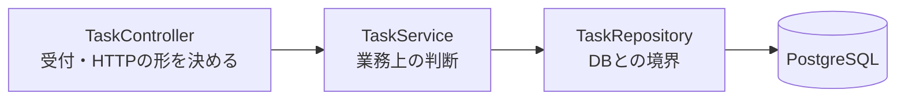

# API設計書 — TaskManagement

← [要件定義書](./requirements.md) に戻る

関連文書：[機能要件・ユースケース](./functional-requirements.md) ／ [画面設計書](./screen-design.md) ／ [データ設計書](./data-design.md) ／ [技術スタック](./tech-stack.md)

| 項目 | 内容 |
|---|---|
| 最終更新日 | 2026-09-10 |
| 版 | 1.2 |

---

## 1. 共通事項

| 項目 | 内容 |
|---|---|
| ベースURL | `http://localhost:8080` |
| 形式 | JSON（`Content-Type: application/json`） |
| 文字コード | UTF-8 |
| 認証 | **なし**（[要件定義書](./requirements.md)のとおり、利用者1名・ローカル専用のため） |

現時点で実装されているのは**読み取り（GET）と登録（POST）**。更新・削除は未実装（6章）。

## 2. エンドポイント一覧

| # | メソッド | パス | 内容 | 実装 |
|---|---|---|---|---|
| 1 | GET | `/api/tasks` | 全件取得 | 済 |
| 2 | GET | `/api/tasks/{id}` | 1件取得 | 済 |
| 3 | GET | `/api/tasks/status/{status}` | status で絞り込み | 済 |
| 4 | POST | `/api/tasks` | 1件登録 | 済 |

### 2.1 GET /api/tasks

全件を返す。並びは `status` 昇順 → `sort_order` 昇順。

**`status` は文字列なので、並びはアルファベット順（`doing` → `done` → `todo`）になり、ボードの表示順（未着手 → 作業中 → 完了）とは一致しない。** 画面側が `status` ごとに振り分けて表示するため、実害はない。表示順を API 側で保証したくなった時点で、`status` を数値の並び順に対応させるか、専用の並び替えを入れる。

| 状態 | コード | 本文 |
|---|---|---|
| 正常 | 200 | Task の配列。0件なら `[]` |

### 2.2 GET /api/tasks/{id}

| 状態 | コード | 本文 |
|---|---|---|
| 見つかった | 200 | Task 1件 |
| 見つからない | **404** | なし |

**存在しない ID を空の JSON で返さない。** 空で返すと、呼び出し側が「無かった」と「中身が空だった」を区別できなくなるため。

### 2.3 GET /api/tasks/status/{status}

`{status}` は `todo` / `doing` / `done`（[データ設計書](./data-design.md) 4章）。並びは `sort_order` 昇順。

| 状態 | コード | 本文 |
|---|---|---|
| 正常 | 200 | Task の配列。該当が0件でも `[]`（404 にはしない。0件は正常な結果） |

**このエンドポイントは現時点でどの画面からも呼ばれない。** F-01 のボード表示は全件を1回取得して画面側で振り分けるため、通信は1回で足りる。講義に合わせて用意しているが、使われないまま残る可能性がある。

### 2.4 POST /api/tasks

1件登録する（[F-02](./functional-requirements.md#f-02-カードの新規作成)）。

**受け取る項目**

| 項目 | 必須 | 型 | 制約 |
|---|---|---|---|
| `title` | **必須** | 文字列 | 空白だけは不可。100文字まで |
| `description` | 任意 | 文字列 | 制限なし |
| `dueDate` | 任意 | 文字列 | `"2026-09-12"` の形。時刻は持たない |
| `priority` | 任意 | 文字列 | `high` / `medium` / `low` |
| `status` | 任意 | 文字列 | `todo` / `doing` / `done`。**省略すると `todo`** |

```json
{ "title": "買い出しに行く", "dueDate": "2026-09-15", "priority": "high", "status": "todo" }
```

**送れない項目がある。** `id` / `createdAt` / `updatedAt` / `sortOrder` は受け口そのものを用意していない（`TaskCreateRequest`）。Task をそのまま受け取る形にすると、送られたものを無視するコードを書いて防ぐことになる。

| 値 | 決めるのは |
|---|---|
| `id` | データベース（自動採番） |
| `createdAt` / `updatedAt` | Hibernate（`@CreationTimestamp` / `@UpdateTimestamp`） |
| `sortOrder` | `TaskService`。**同じ `status` の最大値 + 1**。F-02「作成されたカードはその列の末尾に追加される」に対応する。その列が空なら 1 |

**返すもの**

| 状態 | コード | 本文 |
|---|---|---|
| 登録できた | **201 Created** | 作成された Task 1件（`id` と `sortOrder` が入る） |
| 入力が不正 | **400** | 下記。**データベースには何も入らない** |

200 ではなく 201 を返すのは、「要求を処理した」だけでなく「新しいものが増えた」ことを状態コードで区別するため。`Location` ヘッダーは付けない（呼ぶのは自分の画面1つで、本体に `id` が入っているため、URL を別途伝える相手がいない）。

**400 の本文には理由が入らない（実測）**

```json
{"timestamp":"2026-09-09T21:48:07.650Z","status":400,"error":"Bad Request","path":"/api/tasks"}
```

タイトルが空・`status` が不正・日付の形式違い、**どれも同じ本文が返る**。Spring Boot 4.1.1 の既定であり、次の2つを試しても項目ごとの理由は出なかった。

| 試した設定 | 結果 |
|---|---|
| `server.error.include-message=always` | 本文は変わらなかった |
| `spring.mvc.problemdetails.enabled=true`（既定は `false`） | 形は RFC 9457 になるが `detail` は `"Invalid request content."` 止まり。**「入力が不正」と「そもそも読めなかった」の区別はつく** |

得られるものが小さいのでどちらも入れていない。**したがって、画面に出す文言はフロント側が自前で持つ。** サーバー側の制約に `message = "タイトルは必須です"` のような文言を書いても届かないので、書いていない。

> 実測の方法：`@SpringBootTest(webEnvironment = RANDOM_PORT)` で実際に HTTP を往復させた。**`MockMvc` では本文が空になる**（エラー用の `/error` への転送を再現しないため）ので、この確認には使えない。

## 3. Task の形

```json
{
  "id": 1,
  "title": "要件定義書を通しで読み直す",
  "description": "5文書に分割したあと、記述の重複と矛盾がないか確認する",
  "dueDate": "2026-09-12",
  "priority": "medium",
  "status": "todo",
  "sortOrder": 1,
  "createdAt": "2026-09-07T06:30:00.123456",
  "updatedAt": "2026-09-07T06:30:00.123456"
}
```

列の一覧と型は [データ設計書](./data-design.md) 3章が元。**JSON のキーはキャメルケース**（`due_date` ではなく `dueDate`）で、DB の列名からの変換は Spring Boot 既定の命名戦略が行っている。

> **未決着**：`createdAt` / `updatedAt` はタイムゾーンを持たない。コンテナが UTC で動いているため、JST で見ると9時間ずれる。画面に日時を出す段階で決着させる。

## 4. 層の分け方



**Controller は Repository を直接呼ばない。** 読み取り3本では Service が受け渡すだけの層になり、消しても3本とも動いた（第10回に実験で確認）。

**登録（2.4）を作ったことで、この層に初めて判断が入った。**

| 判断 | 内容 |
|---|---|
| 並び順を決める | 同じ `status` の最大 `sort_order` を読み、その次の番号を付ける |
| 状態を補う | `status` が省略されたら `todo` にする |

どちらも「HTTP をどう受けるか」とは無関係で、画面以外の経路（バッチ処理など）から登録するとしても同じように必要になる。だから Controller ではなくここに置いている。

`TaskRepository` は `JpaRepository` を継承しているだけで、`findAll` / `findById` の**実装を書いていない**。Spring Data JPA が起動時に生成する。独自の条件が要るものだけ、メソッドの宣言を足してある（メソッド名から SQL が組み立てられる）。登録で使う `findFirstByStatusOrderBySortOrderDesc` も宣言1行だけで、`First` は「並べ替えた結果の先頭1件」、`Desc` は降順を意味する。**降順の先頭 = 最大値**になる。

## 5. テストデータ

`backend/src/main/resources/data.sql` に6件（`todo` 3 / `doing` 2 / `done` 1）。

`spring.sql.init.mode=always` で**起動のたびに実行される**。既定値は `always` ではなく `embedded` で、H2 のような組み込みデータベースのときしか動かない。PostgreSQL は組み込みではないため、既定のままだと `data.sql` は黙って無視される。

`spring.jpa.defer-datasource-initialization=true` は、`data.sql` の実行を Hibernate がテーブルを作り終えた後まで**遅らせる**設定。名前に「初期化」とあるがデータを消す設定ではない。`false`（既定）のままだと、空のデータベースから起動したときにテーブルが無い状態で `data.sql` が走り、起動に失敗する。

**`gradlew test` のときは実行されない**（7章）。アプリを起動したときだけ入れ替わる。

## 6. まだ無いために実装できない機能

**要件にはあるが、対応する API が無いために実装できない機能を記録しておく。** 要件と実装のズレを、思い出せる形で残すのが目的である。

| 機能 | 必要な API |
|---|---|
| [F-03](./functional-requirements.md#f-03-カードの編集) 編集 | `PUT` または `PATCH /api/tasks/{id}` |
| [F-04](./functional-requirements.md#f-04-カードの削除) 削除 | `DELETE /api/tasks/{id}` |
| [F-05](./functional-requirements.md#f-05-カードの移動ドラッグドロップ) 列間移動 | `status` の更新 |
| [F-06](./functional-requirements.md#f-06-同じ列の中での並び替え) 列内の並び替え | `sort_order` の更新 |
| [F-09](./functional-requirements.md#f-09-カードの並び替えソート) ソート | `sort_order` の更新（**複数件を一度に**） |
| [F-10](./functional-requirements.md#f-10-並び順の取り消し) 並び順の取り消し | `status` と `sort_order` の更新 |

**F-09 は他と性質が違う。** 1枚のカードを動かす F-05 / F-06 と異なり、**ソートは列の中の全カードの `sort_order` を一度に書き換える**。1件ずつ更新を呼ぶと、カードが10枚あれば通信が10回になり、途中で失敗したときに一部だけ並び替わった状態が残る。まとめて更新する形を用意するかどうかは、**更新 API を作る回に決める**。

F-10 も、戻すのが F-09 の結果であれば同じく複数件の書き換えになる。

**F-02（新規作成）は 2.4 で実装したのでこの一覧から外した。** 残っているのはすべて「既にあるカードを書き換える」操作で、`PUT` / `PATCH` / `DELETE` を作る回にまとめて決める。

## 7. テストが本番のデータを消していた件

`gradlew test` を実行すると、`tasks` テーブルの中身が `data.sql` の6件に入れ替わっていた。**テストが本番と同じ `task_management` データベースに繋ぎ、同じ `application.properties` を読むため、`spring.sql.init.mode=always` が効いて `DELETE` → `INSERT` が丸ごと走っていた。**

第10回に発見して「API で登録できるようになったら対処が必要」として持ち越していたもの。POST を作った時点で、**登録したタスクがテストのたびに消える**という実害になるため決着させた。

対処は `backend/src/test/resources/application-test.properties` の1行。

```properties
spring.sql.init.mode=never
```

テストクラスに `@ActiveProfiles("test")` を付けると、`application.properties` を読んだ**上で**このファイルの項目だけが上書きされる。

**`application.properties` という同じ名前で `src/test/resources` に置いてはいけない。** クラスパスは test 側が先に来るため、main 側が丸ごと読まれなくなり、データベースの接続先まで書き写すことになる。プロファイル名を付けたファイル（`application-<名前>.properties`）は上書きとして働く。

確認したこと：`psql` で1件足してから `gradlew test` を実行し、**件数も `id` も変わらないこと**を確かめた。変更前はここで6件に戻り、`id` も振り直されていた。

---

## 改訂履歴

| 版 | 日付 | 内容 |
|---|---|---|
| 1.0 | 2026-09-07 | 初版。読み取り3本（全件 / 1件 / status 絞り込み）の実装にあわせて新規作成 |
| 1.1 | 2026-09-10 | **6章「まだ無いために実装できない機能」を追加。** F-09（ソート）が複数件の `sort_order` を一度に書き換える点が、1枚を動かす F-05 / F-06 と性質が違うことを記載 |
| 1.2 | 2026-09-10 | **登録 API（2.4 POST /api/tasks）を追加。** 送れない項目と、`sortOrder` を誰が決めるかを明記。400 の本文に理由が入らないことを実測して記載（設定を2つ試した結果も）。6章から F-02 を外し、**7章「テストが本番のデータを消していた件」を新規追加** |
