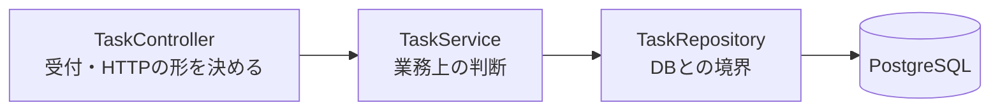

# API設計書 — TaskManagement

← [要件定義書](./requirements.md) に戻る

関連文書：[機能要件・ユースケース](./functional-requirements.md) ／ [画面設計書](./screen-design.md) ／ [データ設計書](./data-design.md) ／ [技術スタック](./tech-stack.md)

| 項目 | 内容 |
|---|---|
| 最終更新日 | 2026-09-07 |
| 版 | 1.0 |

---

## 1. 共通事項

| 項目 | 内容 |
|---|---|
| ベースURL | `http://localhost:8080` |
| 形式 | JSON（`Content-Type: application/json`） |
| 文字コード | UTF-8 |
| 認証 | **なし**（[要件定義書](./requirements.md)のとおり、利用者1名・ローカル専用のため） |

現時点で実装されているのは**読み取り（GET）のみ**。登録・更新・削除は未実装。

## 2. エンドポイント一覧

| # | メソッド | パス | 内容 | 実装 |
|---|---|---|---|---|
| 1 | GET | `/api/tasks` | 全件取得 | 済 |
| 2 | GET | `/api/tasks/{id}` | 1件取得 | 済 |
| 3 | GET | `/api/tasks/status/{status}` | status で絞り込み | 済 |

### 2.1 GET /api/tasks

全件を返す。並びは `status` 昇順 → `sort_order` 昇順。

**`status` は文字列なので、並びはアルファベット順（`doing` → `done` → `todo`）になり、ボードの表示順（未着手 → 作業中 → 完了）とは一致しない。** 画面側が `status` ごとに振り分けて表示するため、実害はない。表示順を API 側で保証したくなった時点で、`status` を数値の並び順に対応させるか、専用の並び替えを入れる。

| 状態 | コード | 本文 |
|---|---|---|
| 正常 | 200 | Task の配列。0件なら `[]` |

### 2.2 GET /api/tasks/{id}

| 状態 | コード | 本文 |
|---|---|---|
| 見つかった | 200 | Task 1件 |
| 見つからない | **404** | なし |

**存在しない ID を空の JSON で返さない。** 空で返すと、呼び出し側が「無かった」と「中身が空だった」を区別できなくなるため。

### 2.3 GET /api/tasks/status/{status}

`{status}` は `todo` / `doing` / `done`（[データ設計書](./data-design.md) 4章）。並びは `sort_order` 昇順。

| 状態 | コード | 本文 |
|---|---|---|
| 正常 | 200 | Task の配列。該当が0件でも `[]`（404 にはしない。0件は正常な結果） |

**このエンドポイントは現時点でどの画面からも呼ばれない。** F-01 のボード表示は全件を1回取得して画面側で振り分けるため、通信は1回で足りる。講義に合わせて用意しているが、使われないまま残る可能性がある。

## 3. Task の形

```json
{
  "id": 1,
  "title": "要件定義書を通しで読み直す",
  "description": "5文書に分割したあと、記述の重複と矛盾がないか確認する",
  "dueDate": "2026-09-12",
  "priority": "medium",
  "status": "todo",
  "sortOrder": 1,
  "createdAt": "2026-09-07T06:30:00.123456",
  "updatedAt": "2026-09-07T06:30:00.123456"
}
```

列の一覧と型は [データ設計書](./data-design.md) 3章が元。**JSON のキーはキャメルケース**（`due_date` ではなく `dueDate`）で、DB の列名からの変換は Spring Boot 既定の命名戦略が行っている。

> **未決着**：`createdAt` / `updatedAt` はタイムゾーンを持たない。コンテナが UTC で動いているため、JST で見ると9時間ずれる。画面に日時を出す段階で決着させる。

## 4. 層の分け方



**Controller は Repository を直接呼ばない。** 今回は読み取りだけなので Service は受け渡すだけの層になるが、「期限切れだけを抽出する」のような判断が入ったときに書く場所を確保している。Controller に書くと、画面以外の経路（バッチ処理など）から同じ判断を使えなくなる。

`TaskRepository` は `JpaRepository` を継承しているだけで、`findAll` / `findById` の**実装を書いていない**。Spring Data JPA が起動時に生成する。独自の並び順が要る2つだけ、メソッドの宣言を足してある（メソッド名から SQL が組み立てられる）。

## 5. テストデータ

`backend/src/main/resources/data.sql` に6件（`todo` 3 / `doing` 2 / `done` 1）。

`spring.sql.init.mode=always` で**起動のたびに実行される**。既定値は `always` ではなく `embedded` で、H2 のような組み込みデータベースのときしか動かない。PostgreSQL は組み込みではないため、既定のままだと `data.sql` は黙って無視される。

`spring.jpa.defer-datasource-initialization=true` は、`data.sql` の実行を Hibernate がテーブルを作り終えた後まで**遅らせる**設定。名前に「初期化」とあるがデータを消す設定ではない。`false`（既定）のままだと、空のデータベースから起動したときにテーブルが無い状態で `data.sql` が走り、起動に失敗する。
