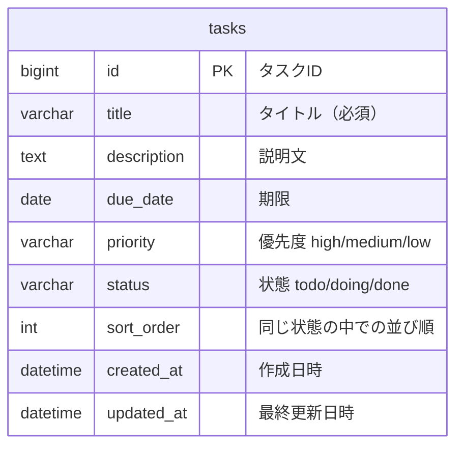

# データ設計書 — TaskManagement

← [要件定義書](./requirements.md) に戻る

関連文書：[機能要件・ユースケース](./functional-requirements.md) ／ [画面設計書](./screen-design.md) ／ [技術スタック](./tech-stack.md)

| 項目 | 内容 |
|---|---|
| 最終更新日 | 2026-09-03 |
| 版 | 3.0 |

---

## 1. システム構成

画面はデータベースを直接触らない。必ずバックエンドの API を経由する。

## 2. ER図

**エンティティは `tasks` の1つのみで、リレーションは存在しない。**

利用者が1名で認証を持たないため、`users` テーブルが不要だからである。図を充実させる目的でエンティティを増やすことはしない。

[要件定義書 8章「今後の拡張候補」](./requirements.md#8-今後の拡張候補) の「ユーザー登録・ログイン」を実装する段階で `users` が追加され、`users` 1 対 `tasks` 多 のリレーションが発生する。

## 3. テーブル定義：tasks

| カラム名 | 型 | NULL | 既定値 | 説明 |
|---|---|---|---|---|
| id | bigint | 不可 | 自動採番 | 主キー |
| title | varchar(100) | 不可 | ― | タイトル。空文字は許可しない |
| description | text | 可 | NULL | 説明文 |
| due_date | date | 可 | NULL | 期限 |
| priority | varchar(10) | 可 | NULL | `high` / `medium` / `low` |
| status | varchar(10) | 不可 | `todo` | `todo` / `doing` / `done` |
| sort_order | int | 不可 | ― | 同じ status の中での並び順 |
| created_at | datetime | 不可 | 現在時刻 | 作成日時 |
| updated_at | datetime | 不可 | 現在時刻 | 最終更新日時 |

`status` と `sort_order` の組み合わせで、ボード上のカードの位置が決まる。

## 4. status の値と表示名

| status の値 | 画面上の表示名 |
|---|---|
| `todo` | 未着手 |
| `doing` | 作業中 |
| `done` | 完了 |

カラムはアプリ側で固定とし、利用者による追加・変更・削除は行わない。
