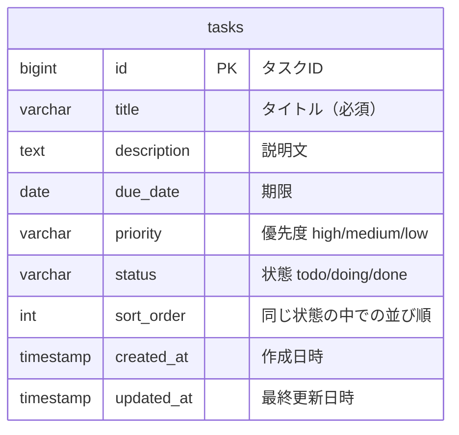

# データ設計書 — TaskManagement

← [要件定義書](./requirements.md) に戻る

関連文書：[機能要件・ユースケース](./functional-requirements.md) ／ [画面設計書](./screen-design.md) ／ [技術スタック](./tech-stack.md)

| 項目 | 内容 |
|---|---|
| 最終更新日 | 2026-09-10 |
| 版 | 3.3 |

---

## 1. システム構成

画面はデータベースを直接触らない。必ずバックエンドの API を経由する。

## 2. ER図

**エンティティは `tasks` の1つのみで、リレーションは存在しない。**

利用者が1名で認証を持たないため、`users` テーブルが不要だからである。図を充実させる目的でエンティティを増やすことはしない。

[要件定義書 8章「今後の拡張候補」](./requirements.md#8-今後の拡張候補) の「ユーザー登録・ログイン」を実装する段階で `users` が追加され、`users` 1 対 `tasks` 多 のリレーションが発生する。

## 3. テーブル定義：tasks

| カラム名 | 型 | NULL | 既定値 | 説明 |
|---|---|---|---|---|
| id | bigint | 不可 | 自動採番 | 主キー |
| title | varchar(100) | 不可 | ― | タイトル。空文字は許可しない |
| description | text | 可 | NULL | 説明文 |
| due_date | date | 可 | NULL | 期限 |
| priority | varchar(10) | 可 | NULL | `high` / `medium` / `low` |
| status | varchar(10) | 不可 | `todo` | `todo` / `doing` / `done` |
| sort_order | int | 不可 | ― | 同じ status の中での並び順 |
| created_at | timestamp(6) | 不可 | 現在時刻 | 作成日時 |
| updated_at | timestamp(6) | 不可 | 現在時刻 | 最終更新日時 |

`status` と `sort_order` の組み合わせで、ボード上のカードの位置が決まる。

**版3.1での修正（2026-09-06）**：版3.0では作成日時・最終更新日時の型を `datetime` と書いていたが、**PostgreSQL に `datetime` という型は存在しない**。実際に生成されたのは `timestamp(6) without time zone` だった。この表は上記の実物（`\d tasks` の出力）と一致している。

**既定値の与え方**：`status` の `todo`、作成日時・最終更新日時の現在時刻は、**DB の DEFAULT 制約ではなくアプリ側（エンティティ）で与えている**。値を入れる経路がバックエンドの API ひとつに限られるため、DB 側に二重で持たせても働く場面がない。`psql` から直接 INSERT する場合はこれらの既定値が効かないので、明示的に値を渡す必要がある。

## 4. status の値と表示名

| status の値 | 画面上の表示名 |
|---|---|
| `todo` | 未着手 |
| `doing` | 作業中 |
| `done` | 完了 |

カラムはアプリ側で固定とし、利用者による追加・変更・削除は行わない。

## 5. テストデータ

`backend/src/main/resources/data.sql` に6件（`todo` 3 / `doing` 2 / `done` 1）。動作確認のためのもので、本番のデータではない。

`spring.sql.init.mode=always` を設定してあるため、**アプリケーションの起動のたびに実行される**。同じ行を何度も入れないよう、スクリプトの先頭で既存の行を削除してから投入している。

### id を書かない理由

`data.sql` の INSERT では `id` を指定していない。指定すると自動採番のシーケンス（次に配る番号の記録）とずれ、あとから API 経由で登録したときに主キーの衝突が起きるため。

**シーケンスは行を削除しても戻らない。** 第09回に `psql` から手で1行入れて削除したあと、テーブルは0件だったが次に配られた番号は `2` だった。「テーブルが空である」ことと「次の番号が1である」ことは別の状態である。

### テストがデータを入れ替える点

**`gradlew test` を実行すると `tasks` テーブルの中身が入れ替わる。** テストは本番と同じ `task_management` データベースに接続し、同じ `application.properties` を読むため、`data.sql`（`DELETE` → `INSERT`）が丸ごと実行されるためである。

実測：`gradlew test` の前後で件数は6件のまま変わらないが、`id` は `14〜19` から `20〜25` に変わった。中身は入れ替わっている。

現時点ではテストデータしか入っていないため実害はない。**API でタスクを登録できるようになった時点で対処が必要**になる（テスト用のデータベースを分ける、あるいは Testcontainers を導入する）。

### 既定値が効かない点

`created_at` / `updated_at` / `status` は、`data.sql` の中で明示的に値を入れている。3章に書いたとおり、これらの既定値は DB の DEFAULT 制約ではなくエンティティ側（`Task.java`）で与えているため、SQL から直接 INSERT すると効かないためである。

### 実行順序の設定

`spring.jpa.defer-datasource-initialization=true` を設定してある。`data.sql` の実行を、Hibernate がテーブルを作り終えた後まで**遅らせる**設定である。名前に「初期化」とあるがデータを消す設定ではない。

`false`（既定）のままだと、空のデータベースから起動したときにテーブルが存在しない状態で `data.sql` が走り、起動に失敗する。

## 6. 読み仮名の列を持たない理由

[F-09 のソート](./functional-requirements.md#f-09-カードの並び替えソート)の軸から**「タイトルのあいうえお順」を外している**。この表に読み仮名の列がないためで、**列を足さない限り実装できない**。

**データベースは漢字の読みを持たない。** 日本語7語を実際に並べて確認した。

| 指定 | 結果 |
|---|---|
| `ORDER BY title`（既定） | あさひ / アサヒ / 大阪 / 山田 / 朝日 / 東京 / 田中 |
| `ORDER BY title COLLATE "ja-x-icu"`（日本語ロケール） | あさひ / アサヒ / 山田 / 大阪 / 朝日 / 田中 / 東京 |

既定は文字コード順で、**ひらがな・カタカナは正しく並ぶが漢字が総崩れ**になる。日本語ロケールを指定すると順序は変わるが五十音順にはならず、**漢字は部首・画数の順**に並ぶ。「東京（とうきょう）」が「田中（たなか）」より後に来ているのがその証拠である。

五十音順にするには `title_kana` のような読み仮名の列を追加し、タスクを作るたびに読みを入力する必要がある。**入力を1項目増やす負担に見合わないと判断し、軸そのものを落とした。**

（ブラウザ側で日本語入力の変換前の文字列を拾って自動で埋める方法もあるが、**コピー＆ペーストしたタイトルは変換を経ていないため拾えない**。自動入力だけでは列は埋まりきらない。）

---

## 改訂履歴

| 版 | 日付 | 内容 |
|---|---|---|
| 3.1 | 2026-09-06 | 作成日時・最終更新日時の型を `datetime` から `timestamp(6)` に修正（PostgreSQL に `datetime` 型は存在しない）。既定値をアプリ側で与えている点を明記 |
| 3.2 | 2026-09-07 | **テストデータの節（5章）を新規追加。** `data.sql` の投入方法、`id` を書かない理由、シーケンスが削除で戻らないこと、`defer-datasource-initialization` の意味を記載 |
| 3.3 | 2026-09-10 | **6章「読み仮名の列を持たない理由」を新規追加。** F-09 のソートの軸から「タイトルのあいうえお順」を外した根拠として、`COLLATE` を変えても漢字が五十音順に並ばないことの実測結果を記載 |
