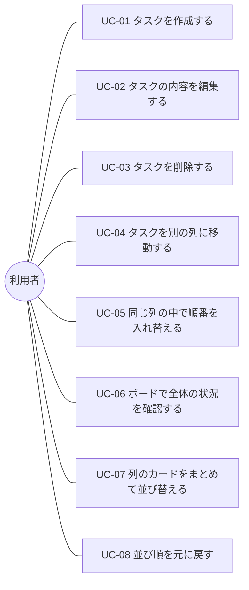

# 機能要件・ユースケース — TaskManagement

← [要件定義書](./requirements.md) に戻る

関連文書：[画面設計書](./screen-design.md) ／ [データ設計書](./data-design.md) ／ [技術スタック](./tech-stack.md)

| 項目 | 内容 |
|---|---|
| 最終更新日 | 2026-09-10 |
| 版 | 4.0 |

---

## 1. 機能要件

### F-01 ボード画面の表示

- アプリを開くと、ボード画面が1ページ表示される
- 起動時にバックエンドからタスクを取得して表示する
- 画面には「未着手」「作業中」「完了」の3つの列が**横並び**で表示される
- 各列には、その列に属するカードが**縦方向に並んで**表示される
- 各列の見出しには、その列に含まれるカードの**件数**を表示する
- 取得に失敗した場合は、画面を白紙にせず**エラーを表示**する

### F-02 カードの新規作成

- 各列に「カードを追加」する操作を用意する
- 入力項目は以下のとおり

| 項目 | 必須 | 内容 |
|---|---|---|
| タイトル | **必須** | タスクの名前 |
| 説明文 | 任意 | タスクの詳細・メモ |
| 期限 | 任意 | 締切の日付 |
| 優先度 | 任意 | 高 / 中 / 低（未指定可） |

- タイトルが空のまま作成しようとした場合は、**作成せずにエラーを表示**する
- 作成されたカードは、その列の**末尾**に追加される

### F-03 カードの編集

- 既存のカードを選択すると、内容を編集できる
- 編集できる項目は F-02 の入力項目と同じ
- タイトルを空にして保存しようとした場合は、**保存せずにエラーを表示**する

### F-04 カードの削除

- カードを削除できる
- 誤操作を防ぐため、**削除前に確認を求める**

### F-05 カードの移動（ドラッグ＆ドロップ）

- カードをドラッグして、別の列にドロップできる
- ドロップした位置にカードが移動し、その列に属する状態になる
- ドラッグ中は、どこにドロップされるかが視覚的に分かるようにする

### F-06 同じ列の中での並び替え

- 同じ列の中で、カードをドラッグして順番を入れ替えられる
- 並び順は保存され、次に開いたときも維持される

### F-07 データの保存

- タスクの内容と並び順は、**バックエンド経由でデータベースに保存**する
- 保存はユーザーの操作を必要とせず、**変更のたびに自動で行う**
- ブラウザを閉じても、別のブラウザから開いても、**同じデータが表示される**
- **保存に失敗した場合は、画面上にエラーを表示する**（成功したように見せてはならない）

### F-08 カードの表示内容

- カードには最低限、**タイトル**を表示する
- 期限が設定されている場合は、カード上に**日付を表示**する
- 優先度が設定されている場合は、**色やラベルで区別できる**ようにする

### F-09 カードの並び替え（ソート）

- 各列の見出しから、並び替えの軸を選んで実行できる
- **並び替わるのは実行した列の中だけ**とする。他の2列の並びは変わらず、カードが列をまたいで移動することもない
- 軸は次の3つとする

| 軸 | 並び順 | 未設定のカードの扱い |
|---|---|---|
| 期限が近い順 | 期限の**昇順**（近い日付が上） | その列の**末尾** |
| 優先度が高い順 | 高 → 中 → 低 | その列の**末尾** |
| 最近更新した順 | 更新日時の**降順**（新しいものが上） | ― |

- 未設定のカードを末尾に置くのは、先頭に置くと「期限が近い順」で**最も期限の遠いはずのカードが一番上に来てしまう**ため
- 並び替えた結果は**保存され、次に開いたときも維持される**（一時的な表示替えではなく、F-06 と同じ扱いになる）

### F-10 並び順の取り消し

- 直前の並び順に戻せる
- 対象は**並び順を変える操作すべて**とする

| 対象 | 操作 |
|---|---|
| F-05 | カードを別の列にドラッグして移動した |
| F-06 | 同じ列の中でドラッグして順番を入れ替えた |
| F-09 | 軸を選んでソートを実行した |

- **`Ctrl+Z` とヘッダーの「元に戻す」の両方**から実行できる。片方だけにすると、マウスだけの操作かキーボードだけの操作のどちらかで取り消せなくなる（[非機能要件](./requirements.md#6-非機能要件)）
- ページを開いている間は**何回でも**戻せる。**再読み込みすると履歴は消え、戻せなくなる**（履歴はデータベースに保存しない）
- 戻した結果も保存する。**画面の表示だけが戻り、データベースが変更後のまま残る状態を作ってはならない**
- **入力欄にフォーカスがある間・モーダルが開いている間は `Ctrl+Z` を受け取らない。** 文字を打ち間違えて `Ctrl+Z` を押したときに、文字ではなくカードの並びが戻ると事故になるため、ブラウザ標準の文字入力の取り消しを優先する

## 2. ユースケース

### 2.1 ユースケース図

### 2.2 ユースケース一覧

| ID | ユースケース | 目的 | 関連機能 |
|---|---|---|---|
| UC-01 | タスクを作成する | やるべきことを書き出して忘れないようにする | F-02 |
| UC-02 | タスクの内容を編集する | 状況の変化に合わせて内容を直す | F-03 |
| UC-03 | タスクを削除する | 不要になったタスクを消す | F-04 |
| UC-04 | タスクを別の列に移動する | 進捗を反映させる | F-05 |
| UC-05 | 同じ列の中で順番を入れ替える | 取りかかる順番を決める | F-06 |
| UC-06 | ボードで全体の状況を確認する | 残りの量と進み具合を把握する | F-01 / F-08 |
| UC-07 | 列のカードをまとめて並び替える | カードが増えたときに、1枚ずつドラッグせずに取りかかる順番を決める | F-09 |
| UC-08 | 並び順を元に戻す | 意図しない並び替えや誤ったドラッグを取り消す | F-10 |

### 2.3 主要な操作フロー（UC-01 タスクを作成する）

| # | 利用者の操作 | システムの応答 |
|---|---|---|
| 1 | 「未着手」の「＋カードを追加」を押す | S-02 タスク作成モーダルを開く |
| 2 | タイトルを入力する（説明文・期限・優先度は任意） | ― |
| 3 | 「保存」を押す | 入力内容を検証する |
| 4 | ― | タイトルが空の場合、エラーを表示し、モーダルを閉じない |
| 5 | ― | 問題なければバックエンドに保存し、モーダルを閉じる |
| 6 | ― | 「未着手」の末尾に新しいカードを表示し、件数を更新する |
| 7 | ― | 保存に失敗した場合、エラーを表示し、モーダルは開いたままにする |

### 2.4 主要な操作フロー（UC-07 → UC-08 並び替えて、元に戻す）

| # | 利用者の操作 | システムの応答 |
|---|---|---|
| 1 | 「未着手」の見出しから「期限が近い順」を選ぶ | 並び替える前の順番を控えてから、「未着手」の中だけを並び替える |
| 2 | ― | 新しい並び順をバックエンドに保存する |
| 3 | ― | 保存に失敗した場合、エラーを表示し、**並びを元に戻す**（保存できていないのに並び替わったままにしない） |
| 4 | `Ctrl+Z` を押す（または「元に戻す」を押す） | 控えておいた順番に戻し、それも保存する |
| 5 | もう一度 `Ctrl+Z` を押す | さらに1つ前の並び順に戻す。控えが尽きたら「元に戻す」は押せない状態になる |
| 6 | ページを再読み込みする | 最後に保存された並び順が表示される。**控えは消え、それ以上は戻せない** |

画面 ID（S-01〜S-04）の詳細は [画面設計書](./screen-design.md) を参照。

---

## 改訂履歴

| 版 | 日付 | 内容 |
|---|---|---|
| 3.0 | 2026-09-03 | [要件定義書](./requirements.md) 版3.0 の文書分割にともない、機能要件 F-01〜F-08 とユースケース UC-01〜UC-06 を本書として分離 |
| 4.0 | 2026-09-10 | **F-09（列ごとのソート）と F-10（並び順の取り消し）を追加**、UC-07 / UC-08 と操作フロー 2.4 を追加。ソートの軸から「タイトルのあいうえお順」は外した（[データ設計書](./data-design.md) のとおり読み仮名の列を持たないため、五十音順に並べられない） |
