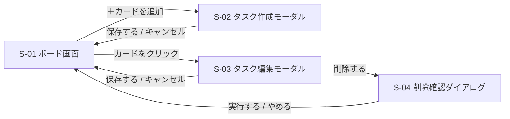
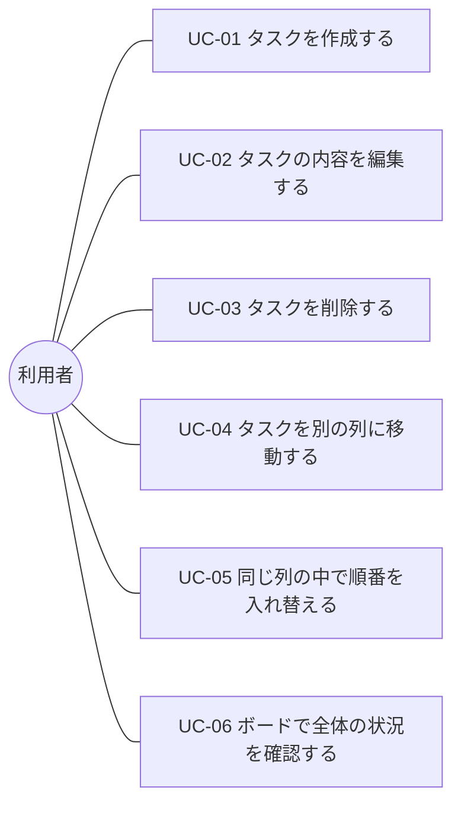
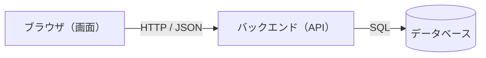
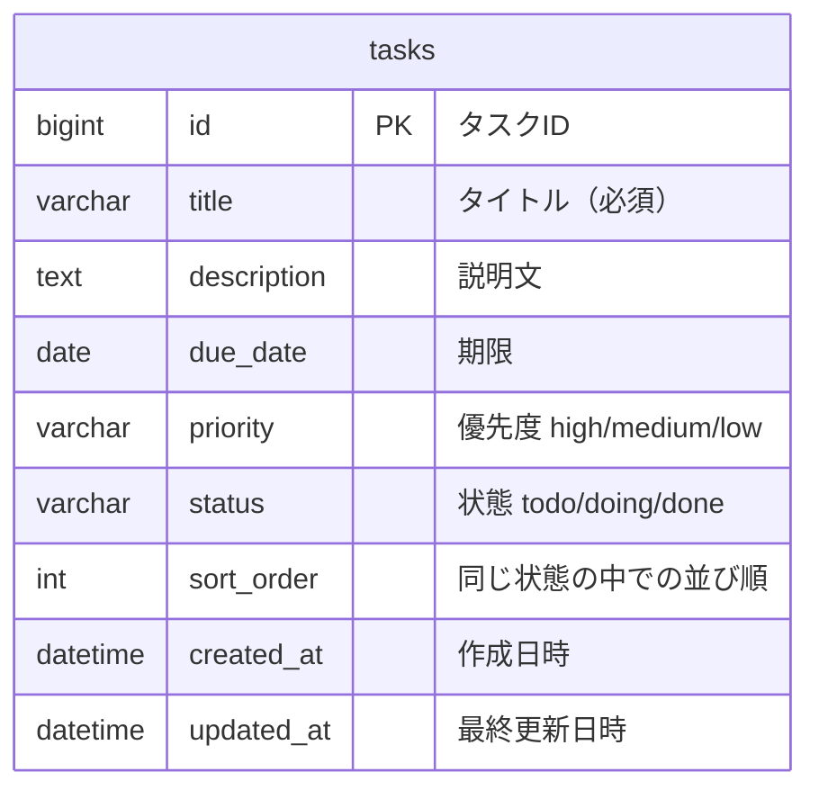

# 要件定義書 — TaskManagement

| 項目 | 内容 |
|---|---|
| プロジェクト名 | TaskManagement |
| 作成日 | 2026-08-27 |
| 最終更新日 | 2026-08-30 |
| 作成者 | itsuiko |
| 版 | 2.0 |
| ステータス | ドラフト |

---

## 1. 概要

Trello 風のカンバンボード形式で、個人のタスクを視覚的に管理できる Web アプリケーションを開発する。

タスクを「付箋（カード）」として扱い、「未着手 / 作業中 / 完了」の3つの列に並べる。カードはドラッグ＆ドロップで列をまたいで移動でき、進捗が一目で分かる状態を作る。

データはブラウザ内ではなく、**バックエンド経由でデータベースに保存**する。

## 2. 目的・背景

- やるべきことの**全体量と進捗状況を一目で把握**できるようにする
- テキストのリストではなく、**カードを動かす操作**によって「進んでいる感覚」を得られるようにする
- RaiseTech AIエンジニアコースの学習課題として、**要件定義から実装までの一連の流れ**を実際に体験する

3点目は本プロジェクト固有の背景である。学習目的であることが、技術選定やスコープ判断の基準になる。

## 3. 想定ユーザー

| 項目 | 内容 |
|---|---|
| 利用者 | 開発者本人ひとり |
| 利用シーン | 学習タスク・私用タスクの管理 |
| 利用環境 | PC のブラウザ（デスクトップ利用を前提とする） |
| 同時利用者数 | 1名（複数人での共有・共同編集は想定しない） |

## 4. スコープ

### 4.1 今回作るもの

- ボード画面（1ページ＋モーダル3種）
- 固定3列のカラム（未着手 / 作業中 / 完了）
- カードの作成・編集・削除
- カードの列間移動（ドラッグ＆ドロップ）
- 同じ列の中でのカードの並び替え
- **バックエンド API 経由でのデータベース保存**

### 4.2 今回作らないもの（対象外）

対象外の項目を、理由とともに2種類に分けて記録する。

| 種別 | 意味 |
|---|---|
| **①** | 目的から論理的に不要。目的が変わらない限り、今後も不要 |
| **②** | 目的には貢献するが、今回は優先度とコストで落とす。12章に回す |

| 対象外の項目 | 種別 | 理由 |
|---|---|---|
| 担当者の割り当て | ① | 利用者が本人ひとりのため、割り当てる相手が存在しない |
| スマートフォン向けの最適化 | ① | PC 利用を前提とするため |
| ユーザー登録・ログイン機能 | ② | 単一利用者のため今回は不要。ただし版2.0でDB構成になり技術的には可能になったため、拡張候補へ移す |
| マルチユーザー対応（共有・同時編集） | ② | 初版では単一利用者に絞る |
| 複数ボードの切り替え | ② | まずは1ボードで完成させることを優先 |
| カラムの追加・名称変更 | ② | 3列固定で十分。設計を単純に保つ |
| 期限切れの警告表示 | ② | 初版では見送り |

## 5. 機能要件

### F-01 ボード画面の表示

- アプリを開くと、ボード画面が1ページ表示される
- 起動時にバックエンドからタスクを取得して表示する
- 画面には「未着手」「作業中」「完了」の3つの列が**横並び**で表示される
- 各列には、その列に属するカードが**縦方向に並んで**表示される
- 各列の見出しには、その列に含まれるカードの**件数**を表示する
- 取得に失敗した場合は、画面を白紙にせず**エラーを表示**する

### F-02 カードの新規作成

- 各列に「カードを追加」する操作を用意する
- 入力項目は以下のとおり

| 項目 | 必須 | 内容 |
|---|---|---|
| タイトル | **必須** | タスクの名前 |
| 説明文 | 任意 | タスクの詳細・メモ |
| 期限 | 任意 | 締切の日付 |
| 優先度 | 任意 | 高 / 中 / 低（未指定可） |

- タイトルが空のまま作成しようとした場合は、**作成せずにエラーを表示**する
- 作成されたカードは、その列の**末尾**に追加される

### F-03 カードの編集

- 既存のカードを選択すると、内容を編集できる
- 編集できる項目は F-02 の入力項目と同じ
- タイトルを空にして保存しようとした場合は、**保存せずにエラーを表示**する

### F-04 カードの削除

- カードを削除できる
- 誤操作を防ぐため、**削除前に確認を求める**

### F-05 カードの移動（ドラッグ＆ドロップ）

- カードをドラッグして、別の列にドロップできる
- ドロップした位置にカードが移動し、その列に属する状態になる
- ドラッグ中は、どこにドロップされるかが視覚的に分かるようにする

### F-06 同じ列の中での並び替え

- 同じ列の中で、カードをドラッグして順番を入れ替えられる
- 並び順は保存され、次に開いたときも維持される

### F-07 データの保存

- タスクの内容と並び順は、**バックエンド経由でデータベースに保存**する
- 保存はユーザーの操作を必要とせず、**変更のたびに自動で行う**
- ブラウザを閉じても、別のブラウザから開いても、**同じデータが表示される**
- **保存に失敗した場合は、画面上にエラーを表示する**（成功したように見せてはならない）

### F-08 カードの表示内容

- カードには最低限、**タイトル**を表示する
- 期限が設定されている場合は、カード上に**日付を表示**する
- 優先度が設定されている場合は、**色やラベルで区別できる**ようにする

## 6. 画面設計

### 6.1 画面一覧

| ID | 画面名 | 種別 | 説明 |
|---|---|---|---|
| S-01 | ボード画面 | ページ | 本アプリで唯一のページ。3列とカードを表示する |
| S-02 | タスク作成モーダル | モーダル | 新しいタスクを入力する |
| S-03 | タスク編集モーダル | モーダル | 既存タスクの内容を変更する |
| S-04 | 削除確認ダイアログ | ダイアログ | 削除の前に確認する |

ページ遷移は発生しない。S-02〜S-04 はすべて S-01 の上に重ねて表示する。

### 6.2 画面レイアウト

**S-01 ボード画面**

```
┌────────────────────────────────────────────────┐
│  TaskManagement                                │
├───────────────┬───────────────┬────────────────┤
│  未着手 (3)   │  作業中 (1)   │  完了 (2)      │
├───────────────┼───────────────┼────────────────┤
│ ┌───────────┐ │ ┌───────────┐ │ ┌────────────┐ │
│ │ タイトル  │ │ │ タイトル  │ │ │ タイトル   │ │
│ │ 高 / 9-01 │ │ │ 中 / 8-30 │ │ │            │ │
│ └───────────┘ │ └───────────┘ │ └────────────┘ │
│ ┌───────────┐ │               │ ┌────────────┐ │
│ │ タイトル  │ │               │ │ タイトル   │ │
│ └───────────┘ │               │ └────────────┘ │
│               │               │                │
│ ＋ カードを追加│ ＋ カードを追加│ ＋ カードを追加│
└───────────────┴───────────────┴────────────────┘
```

**S-02 / S-03 タスク作成・編集モーダル**

```
┌──────────────────────────────┐
│  タスクを追加             ×  │
├──────────────────────────────┤
│  タイトル ＊                 │
│  ┌────────────────────────┐  │
│  │                        │  │
│  └────────────────────────┘  │
│  説明文                      │
│  ┌────────────────────────┐  │
│  │                        │  │
│  │                        │  │
│  └────────────────────────┘  │
│  期限             優先度     │
│  ┌───────────┐   ┌────────┐  │
│  │yyyy/mm/dd │   │ 中   ▼ │  │
│  └───────────┘   └────────┘  │
├──────────────────────────────┤
│          キャンセル    保存  │
└──────────────────────────────┘
```

編集時は見出しを「タスクを編集」とし、既存の値を初期表示する。削除ボタンを併設する。

**S-04 削除確認ダイアログ**

```
┌────────────────────────────────┐
│  このタスクを削除しますか？    │
│                                │
│  「要件定義書を作成する」      │
│                                │
│         やめる     削除する    │
└────────────────────────────────┘
```

### 6.3 画面遷移図



## 7. ユースケース

### 7.1 ユースケース図



### 7.2 ユースケース一覧

| ID | ユースケース | 目的 | 関連機能 |
|---|---|---|---|
| UC-01 | タスクを作成する | やるべきことを書き出して忘れないようにする | F-02 |
| UC-02 | タスクの内容を編集する | 状況の変化に合わせて内容を直す | F-03 |
| UC-03 | タスクを削除する | 不要になったタスクを消す | F-04 |
| UC-04 | タスクを別の列に移動する | 進捗を反映させる | F-05 |
| UC-05 | 同じ列の中で順番を入れ替える | 取りかかる順番を決める | F-06 |
| UC-06 | ボードで全体の状況を確認する | 残りの量と進み具合を把握する | F-01 / F-08 |

### 7.3 主要な操作フロー（UC-01 タスクを作成する）

| # | 利用者の操作 | システムの応答 |
|---|---|---|
| 1 | 「未着手」の「＋カードを追加」を押す | S-02 タスク作成モーダルを開く |
| 2 | タイトルを入力する（説明文・期限・優先度は任意） | ― |
| 3 | 「保存」を押す | 入力内容を検証する |
| 4 | ― | タイトルが空の場合、エラーを表示し、モーダルを閉じない |
| 5 | ― | 問題なければバックエンドに保存し、モーダルを閉じる |
| 6 | ― | 「未着手」の末尾に新しいカードを表示し、件数を更新する |
| 7 | ― | 保存に失敗した場合、エラーを表示し、モーダルは開いたままにする |

## 8. データ設計

### 8.1 システム構成



画面はデータベースを直接触らない。必ずバックエンドの API を経由する。

### 8.2 ER図



**エンティティは `tasks` の1つのみで、リレーションは存在しない。**

利用者が1名で認証を持たないため、`users` テーブルが不要だからである。図を充実させる目的でエンティティを増やすことはしない。

12章の「ユーザー登録・ログイン」を実装する段階で `users` が追加され、`users` 1 対 `tasks` 多 のリレーションが発生する。

### 8.3 テーブル定義：tasks

| カラム名 | 型 | NULL | 既定値 | 説明 |
|---|---|---|---|---|
| id | bigint | 不可 | 自動採番 | 主キー |
| title | varchar(100) | 不可 | ― | タイトル。空文字は許可しない |
| description | text | 可 | NULL | 説明文 |
| due_date | date | 可 | NULL | 期限 |
| priority | varchar(10) | 可 | NULL | `high` / `medium` / `low` |
| status | varchar(10) | 不可 | `todo` | `todo` / `doing` / `done` |
| sort_order | int | 不可 | ― | 同じ status の中での並び順 |
| created_at | datetime | 不可 | 現在時刻 | 作成日時 |
| updated_at | datetime | 不可 | 現在時刻 | 最終更新日時 |

`status` と `sort_order` の組み合わせで、ボード上のカードの位置が決まる。

### 8.4 status の値と表示名

| status の値 | 画面上の表示名 |
|---|---|
| `todo` | 未着手 |
| `doing` | 作業中 |
| `done` | 完了 |

カラムはアプリ側で固定とし、利用者による追加・変更・削除は行わない。

## 9. 非機能要件

機能そのものではないが、品質を左右する要件。**疎かにされやすい一方で、実際に問題として表面化するのはこちら側であることが多い。**

| 分類 | 要件 |
|---|---|
| 対応ブラウザ | 最新版の Chrome / Edge |
| 画面サイズ | 幅 1280px 以上の PC 画面を前提とする。スマートフォン向けの最適化は行わない |
| 性能 | タスク100件でも、ボードの初期表示が2秒以内。ドラッグ操作が引っかからずに動く |
| データ保全 | データはサーバー側のデータベースに保持し、ブラウザや端末が変わっても失われない |
| 障害時の挙動 | バックエンドに接続できない場合、画面を白紙にせずエラーを表示する。保存の失敗を成功したように見せない |
| 操作性 | 主要な操作（追加・移動・削除）がマウスだけで完結する |
| アクセシビリティ | キーボードだけでもタスクの作成・編集・削除ができる。入力欄にはラベルを付ける。文字と背景のコントラスト比は 4.5:1 以上とする |
| セキュリティ | 認証を持たないため、**ローカル環境でのみ動作させ、インターネットには公開しない**。API は同一オリジンからのリクエストのみ受け付ける |
| 保守性 | 画面・API・データ層を分けて実装し、後から機能を追加しやすくする |

## 10. 完了条件（受け入れ条件）

以下がすべて満たされた時点で、初版を完成とする。実装後はこの一覧を上から順に実行して確認する。

| # | 確認する操作 | 期待される結果 |
|---|---|---|
| 1 | アプリを開く | 「未着手 / 作業中 / 完了」の3列が横並びで表示される |
| 2 | 「未着手」にタイトル「テスト」でカードを追加する | 「未着手」の末尾に「テスト」のカードが表示される |
| 3 | タイトルを空のままカードを追加しようとする | カードは作成されず、エラーが表示される |
| 4 | 説明文・期限・優先度を入力してカードを追加する | カード上に期限と優先度が表示される |
| 5 | カードを開いてタイトルを変更し、保存する | ボード上のカードの表示が変更後のタイトルになる |
| 6 | カードを削除する | 確認を求められ、承認するとカードが消える |
| 7 | 「未着手」のカードを「作業中」にドラッグする | カードが「作業中」に移動し、各列の件数表示も変わる |
| 8 | 同じ列の中で、2枚目のカードを1番上にドラッグする | 順番が入れ替わる |
| 9 | 7・8 の操作後にページを再読み込みする | 移動後の列と並び順が、そのまま維持されている |
| 10 | ブラウザを完全に閉じて、開き直す | 登録したタスクがすべて残っている |
| 11 | **別のブラウザ（例：Chrome と Edge）で開く** | **同じタスクが表示される** |
| 12 | **バックエンドを再起動してから開く** | **タスクがすべて残っている** |
| 13 | **バックエンドを停止した状態で開く** | **画面が白紙にならず、エラーが表示される** |
| 14 | すべてのカードを削除して再読み込みする | 空のボードが表示され、エラーにならない |
| 15 | **マウスを使わず、キーボードだけでタスクを1件作成する** | **作成できる** |

11〜13 は、データがブラウザではなくデータベースに保存されていることを確かめるための項目である。

## 11. 技術スタック

**本書の時点では未定とする。**（版1.0から継続）

本書は「何を作るか」を定めるものであり、「どう作るか」は次の設計工程で決定する。先に技術を決めると、その技術で作りやすいものへ要件が引きずられるため、順序を守る。

ただし版2.0でデータベースを採用したことにより、**満たすべき条件は具体化した**。

- フロントエンド / バックエンド / データベースの3層構成を取れること
- ブラウザから呼び出せる Web API を提供できること
- ドラッグ＆ドロップを無理なく実装できること
- 学習目的として、内容を追いやすい構成であること

## 12. 今後の拡張候補

初版では対象外とするが、将来的に検討したい項目（4.2 の種別②に対応）。

- ユーザー登録・ログイン（認証）
- マルチユーザー対応（複数人での共有・同時編集）
- 期限切れタスクの警告表示
- カラムの追加・名称変更
- 複数ボードの切り替え
- タスクの検索・絞り込み
- ラベル / タグ付け
- 完了タスクの一括アーカイブ

---

## 改訂履歴

| 版 | 日付 | 内容 |
|---|---|---|
| 1.0 | 2026-08-27 | 初版作成 |
| 2.0 | 2026-08-30 | **データ保存方式を localStorage からデータベース＋バックエンドに変更。** 画面設計（6章）、ユースケース（7章）、データ設計・ER図（8章）を新規追加。非機能要件（9章）を拡充。対象外項目を種別①②に分類。完了条件を11項目から15項目に更新 |
