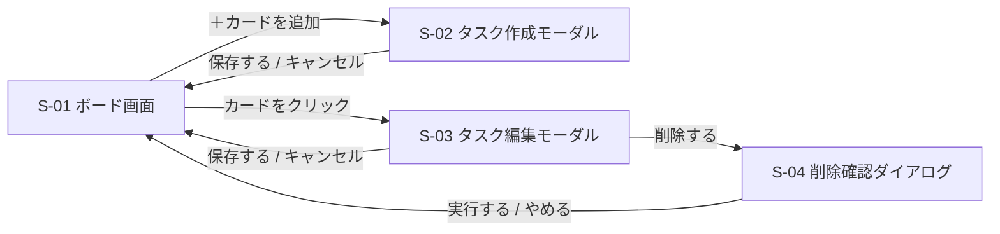

# 画面設計書 — TaskManagement

← [要件定義書](./requirements.md) に戻る

関連文書：[機能要件・ユースケース](./functional-requirements.md) ／ [データ設計書](./data-design.md) ／ [技術スタック](./tech-stack.md)

| 項目 | 内容 |
|---|---|
| 最終更新日 | 2026-09-03 |
| 版 | 3.0 |

---

## 1. 画面一覧

| ID | 画面名 | 種別 | 説明 |
|---|---|---|---|
| S-01 | ボード画面 | ページ | 本アプリで唯一のページ。3列とカードを表示する |
| S-02 | タスク作成モーダル | モーダル | 新しいタスクを入力する |
| S-03 | タスク編集モーダル | モーダル | 既存タスクの内容を変更する |
| S-04 | 削除確認ダイアログ | ダイアログ | 削除の前に確認する |

ページ遷移は発生しない。S-02〜S-04 はすべて S-01 の上に重ねて表示する。

## 2. 画面レイアウト

**S-01 ボード画面**

```
┌────────────────────────────────────────────────┐
│  TaskManagement                                │
├───────────────┬───────────────┬────────────────┤
│  未着手 (3)   │  作業中 (1)   │  完了 (2)      │
├───────────────┼───────────────┼────────────────┤
│ ┌───────────┐ │ ┌───────────┐ │ ┌────────────┐ │
│ │ タイトル  │ │ │ タイトル  │ │ │ タイトル   │ │
│ │ 高 / 9-01 │ │ │ 中 / 8-30 │ │ │            │ │
│ └───────────┘ │ └───────────┘ │ └────────────┘ │
│ ┌───────────┐ │               │ ┌────────────┐ │
│ │ タイトル  │ │               │ │ タイトル   │ │
│ └───────────┘ │               │ └────────────┘ │
│               │               │                │
│ ＋ カードを追加│ ＋ カードを追加│ ＋ カードを追加│
└───────────────┴───────────────┴────────────────┘
```

**S-02 / S-03 タスク作成・編集モーダル**

```
┌──────────────────────────────┐
│  タスクを追加             ×  │
├──────────────────────────────┤
│  タイトル ＊                 │
│  ┌────────────────────────┐  │
│  │                        │  │
│  └────────────────────────┘  │
│  説明文                      │
│  ┌────────────────────────┐  │
│  │                        │  │
│  │                        │  │
│  └────────────────────────┘  │
│  期限             優先度     │
│  ┌───────────┐   ┌────────┐  │
│  │yyyy/mm/dd │   │ 中   ▼ │  │
│  └───────────┘   └────────┘  │
├──────────────────────────────┤
│          キャンセル    保存  │
└──────────────────────────────┘
```

編集時は見出しを「タスクを編集」とし、既存の値を初期表示する。削除ボタンを併設する。

**S-04 削除確認ダイアログ**

```
┌────────────────────────────────┐
│  このタスクを削除しますか？    │
│                                │
│  「要件定義書を作成する」      │
│                                │
│         やめる     削除する    │
└────────────────────────────────┘
```

## 3. 画面遷移図



各画面で使う入力項目とバリデーションは [機能要件（F-02 / F-03）](./functional-requirements.md#f-02-カードの新規作成) を参照。
