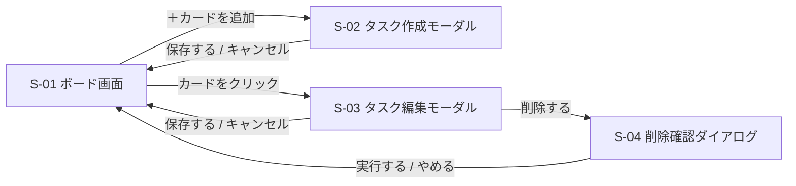

# 画面設計書 — TaskManagement

← [要件定義書](./requirements.md) に戻る

関連文書：[機能要件・ユースケース](./functional-requirements.md) ／ [データ設計書](./data-design.md) ／ [技術スタック](./tech-stack.md)

| 項目 | 内容 |
|---|---|
| 最終更新日 | 2026-09-12 |
| 版 | 4.1 |

---

## 1. 画面一覧

| ID | 画面名 | 種別 | 説明 |
|---|---|---|---|
| S-01 | ボード画面 | ページ | 本アプリで唯一のページ。3列とカードを表示する |
| S-02 | タスク作成モーダル | モーダル | 新しいタスクを入力する |
| S-03 | タスク編集モーダル | モーダル | 既存タスクの内容を変更する |
| S-04 | 削除確認ダイアログ | ダイアログ | 削除の前に確認する |

ページ遷移は発生しない。S-02〜S-04 はすべて S-01 の上に重ねて表示する。

## 2. 画面レイアウト

**S-01 ボード画面**

```
┌────────────────────────────────────────────────┐
│  TaskManagement              [ 元に戻す ]      │
├───────────────┬───────────────┬────────────────┤
│  未着手 (3)   │  作業中 (1)   │  完了 (2)      │
│  並び替え ▼   │  並び替え ▼   │  並び替え ▼    │
├───────────────┼───────────────┼────────────────┤
│ ┌───────────┐ │ ┌───────────┐ │ ┌────────────┐ │
│ │ タイトル  │ │ │ タイトル  │ │ │ タイトル   │ │
│ │ 高 / 9-01 │ │ │ 中 / 8-30 │ │ │            │ │
│ └───────────┘ │ └───────────┘ │ └────────────┘ │
│ ┌───────────┐ │               │ ┌────────────┐ │
│ │ タイトル  │ │               │ │ タイトル   │ │
│ └───────────┘ │               │ └────────────┘ │
│               │               │                │
│ ＋ カードを追加│ ＋ カードを追加│ ＋ カードを追加│
└───────────────┴───────────────┴────────────────┘
```

**「並び替え ▼」を押すと開くメニュー**（[F-09](./functional-requirements.md#f-09-カードの並び替えソート)）

```
┌──────────────────┐
│ 期限が近い順      │
│ 優先度が高い順    │
│ 最近更新した順    │
└──────────────────┘
```

**並び替わるのは、そのメニューを開いた列の中だけ**とする。3列を一度に並び替える操作は用意しない。

**「元に戻す」は `Ctrl+Z` でも実行できる**（[F-10](./functional-requirements.md#f-10-並び順の取り消し)）。ボタンとショートカットの両方を用意するのは、片方だけだとマウスだけの操作かキーボードだけの操作のどちらかで取り消せなくなるためである。**ボタンを見てもショートカットの存在は分からない**ので、ボタンには `Ctrl+Z` が効くことを添える。

戻せる並びが残っていないときは、**ボタンを消さずに押せない状態で表示する。** 消すとボタンの位置が変わり、隣の要素がずれるため。

**S-02 / S-03 タスク作成・編集モーダル**

```
┌──────────────────────────────┐
│  タスクを追加             ×  │
├──────────────────────────────┤
│  タイトル ＊                 │
│  ┌────────────────────────┐  │
│  │                        │  │
│  └────────────────────────┘  │
│  説明文                      │
│  ┌────────────────────────┐  │
│  │                        │  │
│  │                        │  │
│  └────────────────────────┘  │
│  期限             優先度     │
│  ┌───────────┐   ┌────────┐  │
│  │yyyy/mm/dd │   │ 中   ▼ │  │
│  └───────────┘   └────────┘  │
├──────────────────────────────┤
│          キャンセル    保存  │
└──────────────────────────────┘
```

編集時は見出しを「タスクを編集」とし、既存の値を初期表示する。**編集時だけ「状態」の欄が増える。**

```
│  期限             優先度     │
│  ┌───────────┐   ┌────────┐  │
│  │2026/09/20 │   │ 高   ▼ │  │
│  └───────────┘   └────────┘  │
│  状態                        │
│  ┌────────────────────────┐  │
│  │ 作業中               ▼ │  │
│  └────────────────────────┘  │
```

**状態の欄は S-02（作成）には無い。** 作成時はどの列の「＋ カードを追加」を押したかで決まっており、選ばせる必要がないため。

編集時に置いたのは、**マウスを使わずに列を移動する手段がこれしか無い**ためである。列の移動はカードのドラッグ＆ドロップ（F-05）で行うが、ドラッグはマウスの操作で、[非機能要件](./requirements.md#6-非機能要件)の「キーボードだけでタスクの作成・編集・削除ができる」を満たさない。

状態を変えて保存すると、カードは移動先の列の**末尾**に入る（[API設計書](./api-design.md) 2.5）。変えたときだけ、その旨を欄の下に出す。

**削除ボタンは併設していない。** 削除（F-04）の API がまだ無く、押せるのに何も起きないボタンになるため。F-04 を実装する回に足す。

**S-04 削除確認ダイアログ**

```
┌────────────────────────────────┐
│  このタスクを削除しますか？    │
│                                │
│  「要件定義書を作成する」      │
│                                │
│         やめる     削除する    │
└────────────────────────────────┘
```

## 3. 画面遷移図



各画面で使う入力項目とバリデーションは [機能要件（F-02 / F-03）](./functional-requirements.md#f-02-カードの新規作成) を参照。

**並び替え（F-09）と元に戻す（F-10）は遷移図に現れない。** どちらも S-01 の中で完結し、モーダルもダイアログも開かないためである。

---

## 改訂履歴

| 版 | 日付 | 内容 |
|---|---|---|
| 3.0 | 2026-09-03 | [要件定義書](./requirements.md) 版3.0 の文書分割にともない、画面設計を本書として分離 |
| 4.0 | 2026-09-10 | **S-01 に「並び替え ▼」（列ごと）と「元に戻す」を追加。** 並び替えのメニュー、`Ctrl+Z` との併用、戻せる並びが無いときの見せ方を記載。画面遷移図は変更なし |
| 4.1 | 2026-09-12 | **S-03 に「状態」の欄を追加**（編集時だけ現れる）。マウスを使わずに列を移動する手段がこれしか無いため。カードのクリックで開くことと、**削除ボタンをまだ置いていない理由**（F-04 の API が無い）を明記 |
